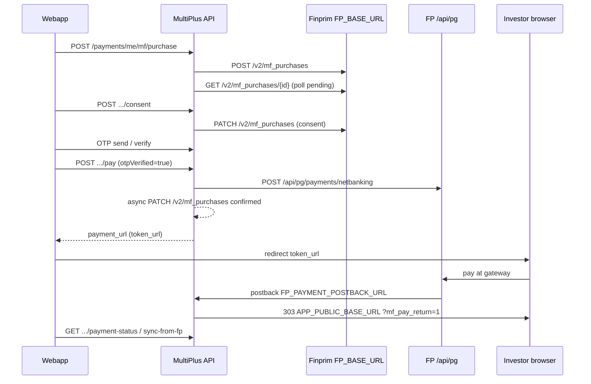

# MF payments master — Lumpsum & SIP (MultiPlus end-to-end)

Single reference for **Mutual Fund checkout**: OAuth tenants, **MultiPlus** HTTP APIs (webapp → backend), and **Finprim / Cybrilla** partner APIs (backend → FP). Covers **lumpsum (one-time)** and **SIP** (mandate + plan + first installment).

**Scope:** Sections 1–10 describe the **MultiPlus** product (Java monorepo). **Section 11** maps the same partner steps to **Zynd** (this repo).

**Related (Zynd repo):**

- [MF_ONDC_LUMPSUM_PAYMENT_FIX_GUIDE.md](./MF_ONDC_LUMPSUM_PAYMENT_FIX_GUIDE.md) — Zynd ONDC deferral vs MultiPlus explicit steps  
- [MF_ONDC_LUMPSUM_PAYMENT_FLOW.md](./MF_ONDC_LUMPSUM_PAYMENT_FLOW.md) — Cybrilla A–H + Zynd invest API list  
- [INVESTOR_PROFILE.md](./INVESTOR_PROFILE.md) — investor provisioning before MF orders  
- [MF_SCHEDULER_PHASES.md](./MF_SCHEDULER_PHASES.md) § Phase 6 — orders, workers, config  

**Related (MultiPlus monorepo only — not in Zynd):**

- `BASKET_INVEST_E2E_CHECKLIST.md` — multi-fund basket batch  
- `KYC_ARCHITECTURE_MODEL.md` §13 — full partner API inventory  

---

## 1. Credential & token map (what uses what)

MultiPlus uses **separate OAuth stacks** for MF investing vs KYC vs Cybrilla POA. Do not mix tokens across hosts or tenants.

| Stack | Java service | Token HTTP | API base | Env (primary) | Tenant / OAuth | Used for |
|-------|--------------|------------|----------|---------------|----------------|----------|
| **MF / payments / OMS** | `FpTokenService` | `POST {FP_BASE_URL}/v2/auth/{FP_TENANT}/token` | `{FP_BASE_URL}` | `FP_*` | MF tenant (e.g. multiplus) | Lumpsum + SIP + mandates + PG in this doc |
| **KYC legacy Finprim** | `KycTokenService` | Same pattern | `KYC_TENANT_BASE_URL` / sandbox | `KYC_TENANT_*`, `DIGILOCKER_FP_*` | KYC tenant | kyc_requests, esigns — not MF checkout |
| **Cybrilla POA (KRA)** | `FpPoaTokenService` | `POST {FP_POA_TOKEN_BASE_URL}/v2/auth/{FP_POA_AUTH_TENANT}/token` | `FP_POA_BASE_URL` | `FP_POA_*` | cybrillapoa | pre_verifications, kyc_forms — not MF checkout |
| **Zero-touch lookups** | `ZtoTokenService` | POA pattern | `ZTO_API_BASE_URL` | `ZTO_*` | cybrillapoa | Lookups — not MF checkout |

### 1.1 MF token request (MultiPlus)

```http
POST {FP_BASE_URL}/v2/auth/{FP_TENANT}/token
Content-Type: application/x-www-form-urlencoded

grant_type=client_credentials&client_id={FP_CLIENT_ID}&client_secret={FP_CLIENT_SECRET}
```

Response: `access_token` (Bearer), `expires_in`. Cached in-memory ~`FP_TOKEN_CACHE_MINUTES` (default 25).

**Zynd equivalent:** `fp_oms_client._get_mf_token()` → `get_finprim_runtime()` (`integration_runtime.py`). Env: `FP_ENABLED`, `FP_BASE_URL`, `FP_TENANT`, `FP_CLIENT_ID`, `FP_CLIENT_SECRET` (live/test via integration config).

### 1.2 MF partner HTTP headers (MultiPlus)

`FintechPrimitivesClient.requestJson`:

- `Authorization: Bearer {FpTokenService token}`
- `Accept` / `Content-Type: application/json`
- `X-Forwarded-For: {user_ip}` when passed

URL: `{FP_BASE_URL}{path}`. **No `x-tenant-id`** on standard MF client (KYC orchestrator may differ).

**Zynd equivalent:** `fp_oms_client._fp_mf_request` — `Authorization`, `x-tenant-id: {runtime.tenant}`, optional `user_ip` on purchase body (not X-Forwarded-For on all calls).

### 1.3 Feature flags (MF)

| Env | Role |
|-----|------|
| `FP_ENABLED=true` | Master gate |
| `FP_LUMPSUM_ENABLED` | One-time invest |
| `FP_SIP_ENABLED` | SIP |
| `FP_PAYMENT_POSTBACK_URL` | PG `payment_postback_url` → API postback route |
| `APP_PUBLIC_BASE_URL` | SPA redirect after postback |
| `FP_PAYMENT_AUTO_SIMULATE` | Sandbox simulate success |

**Zynd equivalent:**

| Env | Role |
|-----|------|
| `FP_ENABLED` / `resolved_fp_enabled` | Master gate |
| `ZYND_MF_ORDERS_ENABLED` | `POST /invest/orders` |
| `ZYND_MF_ORDER_PAYMENT_GATEWAY=ondc` | PG `provider_name: ONDC` |
| `ZYND_MF_PAYMENT_POSTBACK_URL` | Lumpsum / cart postback (Web return route) |
| `ZYND_MF_SIP_MANDATE_POSTBACK_URL` | Mandate auth return |
| `ZYND_MF_MANDATE_PROVIDER` | Often `CYBRILLAPOA` (mandate rail ≠ ONDC netbanking) |

---

## 2. Prerequisites (both flows)

Before lumpsum or SIP, **MfAccountInitService** (MultiPlus) / **Zynd investor + MFIA** ensures on MF token:

| Step | Partner API | Purpose |
|------|-------------|---------|
| Investor | `POST /v2/investor_profiles` | `invp_*` |
| MFIA | `POST /v2/mf_investment_accounts` | `mfia_*` |
| Bank | `POST /v2/bank_accounts` | `external_old_id` for PG |
| Contact | addresses, email, phone | Consent / profile |

**Zynd:** `ensure_pending_investor_profile_for_payment`, `get_or_create_mf_investment_account`, `investor_bank_account_service` sync; tables `mf_investment_accounts`, `investor_bank_accounts`, `mf_orders`, `mf_checkouts`, `mf_sip_plans`, `mf_mandates`.

Gateway default: **`ondc`** on `POST /v2/mf_purchases` / plans (`create_mf_purchase(..., gateway=ondc)`).

---

## 3. Lumpsum (one-time) — full flow

### 3.1 Sequence (Cybrilla ONDC + MultiPlus)



**ONDC rule:** Create PG payment while `mf_purchase` is **`pending`**, then **confirm** purchase → **`submitted`** + valid checkout URL. MultiPlus: netbanking in `/pay`, confirm async right after (`CustomerPaymentResource`).

**Zynd difference:** No separate `/consent` or `/pay` REST steps; **consent + PG + confirm** run inside `advance_ondc_order` on **`GET /invest/orders/{id}/payment-status`** and MF worker. Web: **`POST /invest/orders`** then overlay poll. Optional product OTP is not the same as MultiPlus consent OTP API.

### 3.2 MultiPlus REST (webapp → backend)

Base: `/api/v1/payments/me`. Client: `webapp/src/api/payments.js`.

| Order | Method | Path | Notes |
|-------|--------|------|-------|
| 1 | POST | `/mf/purchase` | Local order + FP purchase |
| 2 | POST | `/mf/purchase/{id}/consent` | PATCH consent |
| 3–4 | POST | `.../otp/send`, `.../otp/verify` | Consent OTP |
| 5 | POST | `/mf/purchase/{id}/pay` | PG + redirect URL |
| — | GET | `.../payment-status` | Poll |
| — | POST | `.../sync-from-fp`, `/retry`, `/cancel` | Ops |

### 3.3 Finprim calls (lumpsum)

| Step | FP API | MultiPlus when | Zynd when |
|------|--------|----------------|-----------|
| A | `POST /v2/mf_purchases` | `POST /mf/purchase` | `submit_pending_order` |
| B | `GET /v2/mf_purchases/{id}` | Poll | `advance_ondc_order` |
| C | `PATCH` consent | `POST /consent` | `_apply_purchase_consent` |
| D | `POST /api/pg/payments/netbanking` | `POST /pay` | `_create_checkout_payment` |
| E | `PATCH` `state: confirmed` | Async after D | `_confirm_purchase_after_payment_setup` |
| F | `GET /api/pg/payments/{id}` | Postback / poll | `_refresh_payment_link` |
| G | `POST /api/pg/simulate/payments/{id}` | Sandbox | (not wired by default) |

**Netbanking body (D):** `amc_order_ids`, `bank_account_id`, `method`, `provider_name: ONDC`, `payment_postback_url`.

### 3.4 Postback & return

| | MultiPlus | Zynd |
|---|-----------|------|
| Partner callback | `POST/GET /api/v1/payments/fp/postback` | Finprim webhook + **browser** `ZYND_MF_PAYMENT_POSTBACK_URL` → Web `/dashboard/mutual-funds/orders/payment-return` |
| Browser | 303 to SPA | Web overlay + `confirm-payment-return` |

### 3.5 Local persistence (lumpsum)

| MultiPlus | Zynd |
|-----------|------|
| `mf_purchase_orders.fp_mf_purchase_id` | `mf_orders.fp_purchase_id` |
| `amc_order_id` | `mf_orders.fp_purchase_old_id` |
| `payment_transactions.fp_payment_id` | `mf_checkouts.fp_payment_id`, `metadata.ondc.fp_payment_id` |
| | `mf_checkouts.token_url` → API `payment_url` |

---

## 4. SIP — full flow

Same **MF token** and `FP_BASE_URL`. Mandates + first installment use `/api/pg/*`; plans use `/v2/mf_purchase_plans`.

### 4.1 Phases

1. **Mandate** — `POST /api/pg/mandates` → authorize  
2. **Plan** — `POST /v2/mf_purchase_plans` → OTP → `PATCH` confirm + consent  
3. **First installment** — child `mf_purchases` + `POST /api/pg/payments/netbanking` (like lumpsum)  
4. **Ongoing** — mandate debits; plan cancel/pause APIs  

### 4.2 MultiPlus REST (SIP)

`/mf/sip/mandate`, `/mf/sip/plan`, `/mf/sip/plan/{id}/confirm`, OTP on `{sipId}`, lifecycle cancel/pause/skip.

### 4.3 Finprim (SIP)

| Step | FP API | MultiPlus | Zynd |
|------|--------|-----------|------|
| Mandate | `POST /api/pg/mandates` | `POST /mf/sip/mandate` | `POST /invest/mandates` |
| Mandate auth | `GET /api/pg/mandates/{id}` | authorize | `POST /invest/mandates/{id}/auth` |
| Plan | `POST /v2/mf_purchase_plans` | `POST /mf/sip/plan` | `POST /invest/sip/plans` |
| Plan confirm | `PATCH` confirmed + consent | `POST .../confirm` | `submit_pending_sip_plan` / worker |
| First installment | `GET mf_purchases?plan`, netbanking | on confirm attach | `POST .../first-installment/pay`, `mf_sip_installment_order_service` |
| Recurring | mandate | — | `mf_mandate_service` |

Mandate `provider_name`: **CYBRILLAPOA** (default in Zynd) vs **ONDC** on lumpsum netbanking.

### 4.4 SIP rules

- Mandate **APPROVED** before plan create  
- First installment PG only when plan confirmed + gates satisfied  
- Avoid duplicate netbanking if installment already paid  
- E-mandate vs UPI method mapping for first checkout  

**Zynd files:** `mf_sip_plan_service.py`, `mf_mandate_service.py`, `mf_sip_installment_order_service.py`, `fp_mandate_client.py`.

**Daily vs monthly SIP (Zynd):** [MF_SIP_DAILY_FREQUENCY.md](./MF_SIP_DAILY_FREQUENCY.md) — frequency field, OMS validation, invest card, and cart.

---

## 5. Side-by-side: Lumpsum vs SIP first payment

| Topic | Lumpsum | SIP (first installment) |
|-------|---------|-------------------------|
| OAuth | `FpTokenService` / `FP_*` | Same |
| OMS create | `POST /v2/mf_purchases` | `POST /v2/mf_purchase_plans` + child purchase |
| Consent | PATCH purchase | PATCH plan confirm + consent |
| OTP gate | Before `/pay` | Before plan confirm (MultiPlus); Zynd: product-specific |
| PG create | `/pay` → netbanking | On confirm attach → netbanking |
| Purchase confirm | Async after PG (lumpsum) | Plan confirmed; installment purchase paid like lumpsum |
| Redirect | `payment_url` from `/pay` | `paymentUrl` on confirm |
| Postback | `/fp/postback` | Same pattern (installment order) |
| Recurring | N/A | `/api/pg/mandates` |

---

## 6. Basket checkout (brief)

**MultiPlus:** `/api/v1/payments/me/mf/basket/lumpsum` — batch purchases, one netbanking with multiple `amc_order_ids`.

**Zynd:** `POST /invest/cart/checkout` (lumpsum cart), `advance_ondc_cart_checkout`, `_create_cart_checkout_payment` with multiple `amc_order_ids`. SIP cart: `POST /invest/cart/sip/checkout`.

---

## 7. MultiPlus backend code index (external repo)

| Area | Path |
|------|------|
| MF OAuth | `payment/fp/service/FpTokenService.java` |
| FP HTTP | `payment/fp/service/FintechPrimitivesClient.java` |
| Lumpsum | `payment/service/PaymentService.java` |
| SIP | `payment/service/SipIntegrationService.java` |
| REST | `payment/api/CustomerPaymentResource.java` |
| Postback | `payment/api/FpPaymentPostbackResource.java` |
| Basket | `CustomerBasketPaymentResource.java`, `BasketOrchestratorService.java` |
| MFIA | `payment/fp/service/MfAccountInitService.java` |

---

## 8. MultiPlus webapp index (external repo)

| Area | Path |
|------|------|
| API | `webapp/src/api/payments.js` |
| Lumpsum OTP | `webapp/src/utils/mfPurchaseConsentOtpResend.js` |
| UI | `webapp/src/views/dashboard/invest/*` |

**Zynd Web:** `Web/src/features/invest/api/invest-api.ts`, `mf-invest-payment-card.tsx`, `mf-order-pay-view.tsx`, `mf-sip-mandate-view.tsx`.

---

## 9. Environment cheat sheet (MF payments)

```env
# MultiPlus-style MF OAuth (Zynd: FP_* + integration runtime)
FP_ENABLED=true
FP_BASE_URL=https://api.fintechprimitives.com
FP_TENANT=multiplus
FP_CLIENT_ID=...
FP_CLIENT_SECRET=...

FP_LUMPSUM_ENABLED=true
FP_SIP_ENABLED=true

FP_PAYMENT_POSTBACK_URL=https://<api-host>/api/v1/payments/fp/postback
APP_PUBLIC_BASE_URL=https://<web-host>

# Zynd additions
ZYND_MF_ORDERS_ENABLED=true
ZYND_MF_ORDER_PAYMENT_GATEWAY=ondc
ZYND_MF_PAYMENT_POSTBACK_URL=https://<web-host>/dashboard/mutual-funds/orders/payment-return
ZYND_MF_WORKER_AUTOSTART=true
ZYND_MF_FP_USER_IP_FALLBACK=<public-ipv4>
```

**Not for MF checkout:** `FP_POA_*`, `KYC_TENANT_*` (KYC only).

---

## 10. Troubleshooting

| Symptom | Check |
|---------|--------|
| Partner token unavailable | `FP_ENABLED`, credentials, token POST |
| 401 on MF | Wrong host/tenant; invalidate token cache |
| No `token_url` (lumpsum) | Not `pending`; consent; confirm before PG; bad `old_id` |
| PG 422 ONDC | Wrong step order; duplicate netbanking on paid SIP installment |
| Postback never hits API | URL points at SPA only — MultiPlus needs API `/fp/postback`; Zynd needs whitelisted postback on PG create |
| Instant “link no longer valid” (Zynd) | Stale sessionStorage, reused cancelled order, reconcile `payment_abandoned` — see [fix guide](./MF_ONDC_LUMPSUM_PAYMENT_FIX_GUIDE.md) |
| Mandate stuck | `GET /api/pg/mandates/{id}`; complete auth |

---

## 11. Zynd platform API map (this repo)

Base: **`/api/v1/invest`**. Auth: investor session + fund eligibility where noted.

### 11.1 Lumpsum

| MultiPlus | Zynd |
|-----------|------|
| `POST /mf/purchase` | `POST /invest/orders` |
| `POST /consent` + OTP + `POST /pay` | (partner steps inside) `GET /invest/orders/{id}/payment-status` |
| `GET /payment-status` | Same path |
| — | `GET /invest/orders/{id}` |
| — | `POST /invest/orders/{id}/confirm-payment-return` |
| — | `POST /invest/orders/{id}/abandon-payment` (explicit cancel only) |

### 11.2 Cart lumpsum

| MultiPlus basket | Zynd |
|------------------|------|
| Batch purchase + one PG | `POST /invest/cart/checkout`, `GET .../payment-status`, `abandon-payment` |

### 11.3 SIP

| MultiPlus | Zynd |
|-----------|------|
| `POST /mf/sip/mandate` | `POST /invest/mandates` |
| mandate authorize | `POST /invest/mandates/{id}/auth` |
| `POST /mf/sip/plan` | `POST /invest/sip/plans` |
| validate | `POST /invest/sip/plans/validate` |
| plan confirm + first pay | Worker + `POST /invest/sip/plans/{id}/first-installment/pay` |
| mandate/plan return | `confirm-mandate-return`, `confirm-first-installment-return` |
| abandon mandate | `POST /invest/sip/plans/{id}/abandon-mandate` |

### 11.4 Zynd backend code index

| Area | Path |
|------|------|
| MF token + HTTP | `app/infrastructure/mf/fp_oms_client.py` |
| PG netbanking | `app/infrastructure/mf/fp_payment_client.py` |
| ONDC lumpsum pipeline | `app/application/mf/mf_ondc_order_service.py` |
| Payment advance / abandon | `app/application/mf/mf_payment_flow_service.py` |
| Reconcile | `app/application/mf/mf_lumpsum_reconciliation_service.py` |
| Orders API | `app/api/v1/invest/router.py` |
| SIP plans | `app/application/mf/mf_sip_plan_service.py` |
| Mandates | `app/application/mf/mf_mandate_service.py`, `fp_mandate_client.py` |
| First installment | `app/application/mf/mf_sip_installment_order_service.py` |
| Worker | `app/jobs/run_mf_transaction_workers.py` |

### 11.5 Partner call logging (Zynd dev)

Terminal: `[FINPRIM]` (every MF HTTP), `[MF-PAY]` (ONDC milestones). Enable worker tee: `ZYND_MF_WORKER_LOG_TO_TERMINAL=true`.

---

*Grounded in MultiPlus `com.multiplus.payment.*` and `webapp/src/api/payments.js` (external). Zynd §11 verified against `app/api/v1/invest/router.py`. Partner contracts: Finprim MF Purchases v2, MF Purchase Plans, PG Payments (netbanking / mandates / ONDC).*
