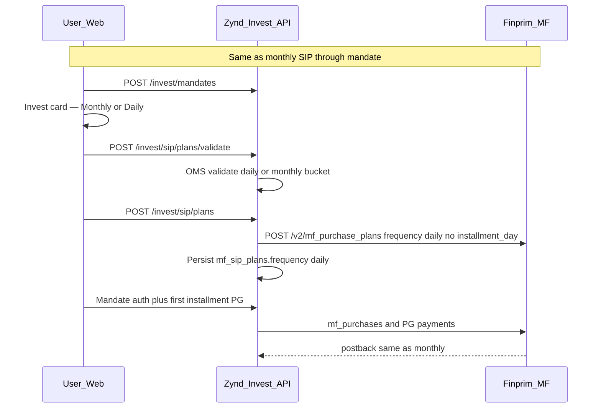

# Daily SIP — Zynd (extension of monthly SIP)

Daily SIP builds on the existing monthly SIP flow. Mandate creation, plan submit to Finprim, first-installment payment gateway, postback, and ongoing mandate debits follow the same paths as monthly SIP. What differs is frequency selection, fund eligibility (OMS `sip_options`), validation rules, Finprim create-plan payload, cart persistence, portfolio aggregates, and UI copy.

For OAuth, REST routes, and Finprim step tables, start with [MF_PAYMENTS_MASTER_LUMPSUM_SIP.md](./MF_PAYMENTS_MASTER_LUMPSUM_SIP.md) §4 (SIP) and §11 (Zynd mapping). This document covers **daily vs monthly only**.

---

## 1. Product behaviour (user-facing)

| Aspect | Monthly SIP (default) | Daily SIP |
|--------|----------------------|-----------|
| Frequency values | `monthly` (omitted → monthly) | `daily` |
| SIP debit day | User picks day 1–28 (`MfSipDayPicker`) | No debit-day UI; debits follow FP daily schedule |
| Min amount / min installments | Monthly OMS block in `sip_options` or `fund.min_sip_amount` | Daily block in `sip_options` (`min_inr`, `min_installments`) |
| Fund support | `sip_allowed` + monthly constraints | Same `sip_allowed`, plus daily entry in stored `investment_constraints.sip_options` when OMS exposes daily |
| Mandate | Same e-mandate / UPI mandate | Same; mandate limit covers per-installment amount |
| Checkout after plan create | Mandate auth → first installment PG | Identical |

---

## 2. End-to-end flow (single fund)

**Backward compatibility:** Clients that omit `frequency` on validate/plan/cart APIs behave as before (monthly; installment day required on API when monthly).

---

## 3. Finprim create-plan payload

Central logic: `submit_pending_sip_plan` in [`mf_sip_plan_service.py`](../../app/application/mf/mf_sip_plan_service.py).

| Field | Monthly | Daily |
|-------|---------|-------|
| `frequency` | `"monthly"` | `"daily"` |
| `installment_day` | Plan day (required locally) | Omitted from FP body (`null` stored) |
| Other fields | `payment_method: mandate`, `auto_generate_installments`, `generate_first_installment_now`, etc. | Same |

SIP cart checkout creates one plan per cart line via `create_sip_plan`, each with the cart line’s `frequency`.

---

## 4. Zynd REST — frequency fields

Base path: `/api/v1/invest` (auth required).

| Endpoint | Field | Notes |
|----------|-------|-------|
| `POST /sip/plans/validate` | `frequency` | Optional. `monthly` \| `daily`. Invalid → 400. |
| `POST /sip/plans` | `frequency` | Optional; stored on `mf_sip_plans`. |
| `POST /sip/plans` | `installment_day` | Ignored by FP for daily (may be stored as null). |
| `PUT /cart/items` (upsert) | `frequency` | Per SIP line; cart must not mix frequencies. |

Plan responses include `frequency`, `installment_day`, `number_of_installments`.

---

## 5. Backend validation (OMS)

Helpers in [`investment_constraints.py`](../../app/application/mf/investment_constraints.py):

- `sip_option_for_frequency(fund, frequency)` — reads `fund.investment_constraints.sip_options`.
- `assert_sip_frequency_allowed(fund, frequency)` — daily without daily node when options exist → `"Daily SIP is not available for this fund."`
- Amount min/max and min installments from the frequency-specific option when present; else monthly falls back to `fund.min_sip_amount`.

Used by `validate_sip_plan_inputs` and `create_sip_plan` in [`mf_sip_plan_service.py`](../../app/application/mf/mf_sip_plan_service.py).

Installment day checks run only for monthly (`_validate_installment_day`).

---

## 6. Database and catalog

- `mf_sip_plans.frequency` — set on create (monthly or daily).
- `mf_cart_items.frequency` — SIP cart line frequency.
- `mutual_funds.investment_constraints` — JSON snapshot including `sip_options` from Cybrilla scheme `sip_frequency_specific_data` (ingestion pipeline).

Fund detail API exposes `investment_details.sip_options` for the Web invest card.

---

## 7. Web app (customer)

| Area | Files |
|------|-------|
| Frequency helpers | `Web/src/features/invest/lib/mf-sip-frequency.ts` |
| Invest card toggle | `mf-invest-payment-card.tsx`, `mf-sip-frequency-chips.tsx` |
| Fund detail | `mf-fund-detail-view.tsx` passes `sip_options` |
| SIP cart | `mf-cart-view.tsx` — cart-level frequency, hide day picker when daily |
| Portfolio holding | `portfolio-holding-sip.ts` — monthly vs daily split display |
| My SIPs | `mf-format.ts` — `formatSipFrequencyLabel` |

---

## 8. Basket / cart orchestration

[`mf_cart_service.py`](../../app/application/mf/mf_cart_service.py):

- `upsert_cart_item(..., frequency)` persists line frequency.
- Validates each SIP line with the same OMS rules as single-fund plan create.
- Rejects mixed frequencies across SIP items (`sip_frequency_mismatch`).
- `checkout_sip_cart` — shared mandate; max line amount for mandate limit (correct for daily per-installment).

---

## 9. Portfolio aggregates

[`portfolio_holdings_service._load_sip_stats`](../../app/application/mf/portfolio_holdings_service.py):

- Monthly plans sum at face value.
- Daily plans contribute `amount × 30` to `monthly_sip_inr` (monthly equivalent for dashboard).

Holding detail Web UI shows separate monthly and daily commitment where applicable.

---

## 10. What did not change

- MF OAuth and Finprim integration runtime.
- Mandate APIs and approved mandate before plan submit.
- First installment: child purchases + PG netbanking/UPI.
- Postback URLs and SPA return routes.
- Plan lifecycle cancel / bank switch routes (FP plan carries frequency).

---

## 11. Configuration

| Env | Role |
|-----|------|
| `ZYND_MF_SIP_DEFAULT_MONTHLY_INSTALLMENTS` | Default installments when omitted (monthly) |
| `ZYND_MF_SIP_DEFAULT_DAILY_INSTALLMENTS` | Default installments when omitted (daily), default `30` |

---

## 12. Testing checklist

1. Fund with daily in `sip_options`: toggle Daily → no debit day → validate + plan create; FP payload `frequency: daily`, no `installment_day`.
2. Fund without daily OMS node: Daily chip hidden or API error on forced daily.
3. Omit `frequency` on plan API → monthly behaviour (installment day required).
4. SIP cart: switch frequency updates lines; cannot mix frequencies; daily cart skips day validation on rows.
5. Portfolio: holding with both monthly and daily plans shows split amounts.
6. Admin SIP plan list/detail shows `daily` for daily plans.

---

## Related

- [MF_PAYMENTS_MASTER_LUMPSUM_SIP.md](./MF_PAYMENTS_MASTER_LUMPSUM_SIP.md) — full SIP + lumpsum API map
