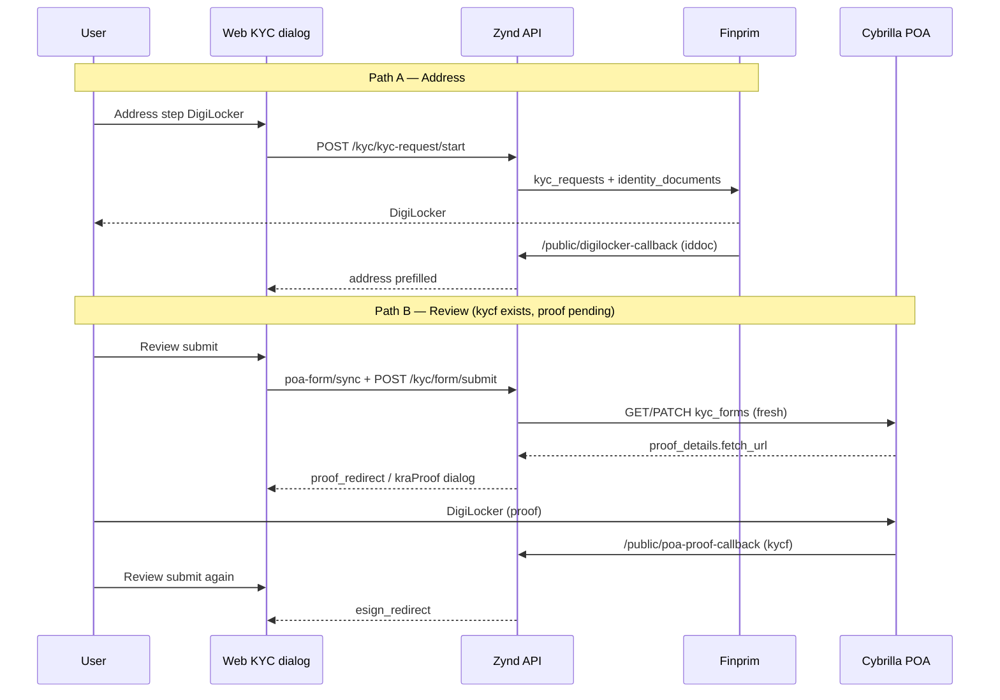

# Dual DigiLocker — new-to-KYC, Zynd hybrid setup & `.env`

Plain-language guide for when **address DigiLocker succeeds** (Finprim `iddoc_*`) but **Cybrilla POA proof stays pending** (`kycf_*`). Use for **J3 `kra_update`** or **misconfigured J2** (POA gate still running).

**J2 `fresh_kyc` spec:** one DigiLocker only — [KYC_ZYND_TEACHING_J2_SINGLE_DIGILOCKER.md](./KYC_ZYND_TEACHING_J2_SINGLE_DIGILOCKER.md).

Related: [KYC_DIGILOCKER_FLOW.md](./KYC_DIGILOCKER_FLOW.md).

---

## 1. The confusion in one sentence

You can succeed at **Finprim DigiLocker** and still need a **second, one-time DigiLocker** on the **Cybrilla POA form** — redoing address DigiLocker only refreshes `iddoc_*`; it does **not** set `proof_details` on `kycf_*`.

---

## 2. Two DigiLocker flows (what your logs mean)

| When | Partner | ID in logs / DB | What it satisfies |
|------|---------|-----------------|-------------------|
| **Address / contact step (Path A)** | Finprim (DigiLocker tenant) | `iddoc_…`, `external_identity_document_id` | Wizard address prefilled; Finprim KYC request |
| **Review submit (Path B)** | Cybrilla POA | `kycf_…`, `external_kyc_form_id`, `proof_details.fetch_url` | KRA/POA form `identity_proof` + address on the form |

```
Address step:     Finprim  iddoc_abc123     → contact draft, external_kyc_status
Review (POA):     Cybrilla kycf_4dadde04… → proof_details.status (want fetched)
                  NOT the same as iddoc_abc123
```

---

## 3. “New to KYC” — how many DigiLocker trips?

Journey mode: **`fresh_kyc`** (from KRA readiness / `kyc_unavailable`).

| Phase | What the user usually sees | What happens under the hood |
|-------|----------------------------|-----------------------------|
| PAN → **Address** | One DigiLocker (“fetch verified documents”) | `POST /api/v1/kyc/kyc-request/start` → Finprim `/v2/kyc_requests` + `/v2/identity_documents` → redirect → `/api/v1/kyc/public/digilocker-callback` |
| **Review submit** | Second DigiLocker **if** a POA `kycf_*` exists and proof is not fetched | `POST /kyc/poa-form/sync` (or bind via `ensure_kyc_form`) → read `proof_details.fetch_url` → **`proof_redirect`** → `/api/v1/kyc/public/poa-proof-callback` |

Product copy on the **address** step describes Path A only. In **hybrid** environments (Finprim sandbox + Cybrilla POA for forms/KRA), **Path B at Review is still required once** per active `kycf_*` form when the partner returns a `fetch_url`.

**KRA update (`kra_update`)** is different: often no Finprim DigiLocker on PAN (manual address), then one POA DigiLocker at Review. **New-to-KYC** is the case where **both** paths often apply.

### Code references (Zynd)

| Area | Location |
|------|----------|
| Path A start / hydrate | `Backend/app/application/kyc/finprim_identity_service.py`, `POST /kyc/kyc-request/start` |
| Path A gate | `Backend/app/application/kyc/kyc_flow_mode.py`, `requires_address_step_digilocker` |
| Path B sync / proof resolve | `Backend/app/application/kyc/poa_kyc_form_service.py`, `path_a_proof.py` |
| Review submit → proof redirect | `Backend/app/application/kyc/kyc_form_service.py` (`submit_kyc_form`, `_proof_redirect_action`) |
| Web — address vs KRA dialog | `Web/src/features/kyc/components/kyc-dialog.tsx` (`digilockerRedirectVariant`: `address` \| `kraProof`) |
| Review POA gate before submit | `Web/src/features/kyc/lib/kyc-poa-review-pipeline.ts` |

---

## 4. Zynd / hybrid issue (why it felt like an error)

### 4.1 Symptom

- Logs: `GET /poa/kyc_forms/kycf_…` with `proof=pending` repeatedly.
- Finprim: identity document success, address filled.
- Submit returned **200** with `nextAction: processing` (“waiting for KRA proof sync”).
- UI treated that as failure even though Finprim succeeded.

### 4.2 Root cause

- Server sync / `retry_proof_details_fetch` **cannot** complete Cybrilla `proof_details` without the user visiting **`proof_details.fetch_url` once** (browser DigiLocker on the POA side).
- Hiding the second step after Path A succeeded left users stuck at `proof=pending`.

### 4.3 Intended product behavior (current)

- On **Review submit**, if POA proof is incomplete and Cybrilla returns a **`fetch_url`**, API returns **`proof_redirect`** and Web opens **“Link KRA KYC form”** (`kraProof` dialog) — **even when address DigiLocker already succeeded**.
- User completes Path B once → callback `poa_proof_return=1&kyc_form=kycf_…` → proof status moves toward **fetched**.
- **Submit Review again** → signature (if needed) → **eSign**.

Status polling / bootstrap **does not** auto-open Path B (avoids surprise popups); **explicit submit** triggers the KRA link when required.

---

## 5. Operator checklist

1. Finish **address DigiLocker (Path A)** — `iddoc_*` on journey is OK.
2. Complete wizard through **Review** (location + `POST /kyc/poa-form/sync` as usual).
3. On submit, if **“Link KRA KYC form”** appears → complete that DigiLocker (updates **`kycf_…`**, not `iddoc`).
4. Return via `/api/v1/kyc/public/poa-proof-callback` → land on `/dashboard/kyc?poa_proof_return=1&kyc_form=…`.
5. **Submit Review again** → eSign.

**Do not** rely on “Redo DigiLocker” on the address step to fix `proof=pending` on `kycf_*`.

---

## 6. IDs in the database (quick reference)

| Field | Example | Meaning |
|-------|---------|---------|
| `external_identity_document_id` | `iddoc_…` | Finprim Path A |
| `external_kyc_request_id` | `krq_…` | Finprim KYC request |
| `external_kyc_form_id` | `kycf_4dadde04…` | Cybrilla POA form |
| `kyc_form_type` | `fresh` or `modify` | New vs KRA update |
| `proof_details_status` (journey) | `pending` → `fetched` | Path B completion |

JSON like `{"form_id":"kycf_4dadde04…"}` from Cybrilla is the **POA form id** — normal and separate from `iddoc_*`.

---

## 7. Environment variables — full KYC / DigiLocker / POA

Put these in **`Backend/.env`** (git-ignored). Restart API after changes: `Backend/./run.sh`. Web only needs the API base URL (no partner secrets).

See **`Backend/.env.example`** for the full list and comments.

### 7.1 Public URLs (callbacks must be reachable by Finprim & Cybrilla)

| Variable | Required | Example (local) | Used for |
|----------|----------|-----------------|----------|
| **`API_PUBLIC_URL`** | Yes (POA callbacks) | Tunnel HTTPS or shared dev API | Base for `resolved_kyc_proof_callback_url`, eSign callback |
| **`DIGILOCKER_FP`** or **`KYC_DIGILOCKER_CALLBACK_URL`** | Yes (Path A) | `https://YOUR-HOST/api/v1/kyc/public/digilocker-callback` | Finprim `postback_url` on identity document |
| **`KYC_DIGILOCKER_WEB_REDIRECT_ORIGIN`** | Yes | `http://localhost:7777` | Browser 302 after DigiLocker callbacks |
| **`KYC_DIGILOCKER_WEB_REDIRECT_PATH`** | No | `/dashboard/kyc` | Default wizard return path |
| **`KYC_PROOF_CALLBACK_URL`** | Optional | Defaults from `API_PUBLIC_URL` | POA proof partner callback |
| **`KYC_ESIGN_CALLBACK_URL`** | Optional | Defaults from `API_PUBLIC_URL` | POA eSign callback |

**Local dev trap:** `localhost` in callback URLs is **not** reachable from Finprim/Cybrilla servers — use ngrok, Cloudflare tunnel, or a shared dev API host and set **`API_PUBLIC_URL`** + **`DIGILOCKER_FP`** to that HTTPS origin.

Typical POA proof callback path:

`{API_PUBLIC_URL}/api/v1/kyc/public/poa-proof-callback`

(Config resolves this via `Settings.resolved_kyc_proof_callback_url` in `Backend/app/core/config.py`.)

### 7.2 Finprim / DigiLocker tenant (Path A — address step)

Often sandbox: `https://s.finprim.com`. Enable with **`KYC_DIGILOCKER_SANDBOX=true`**.

| Variable | Purpose |
|----------|---------|
| `DIGILOCKER_FP_BASE_URL` | API host for kyc_requests / identity_documents |
| `DIGILOCKER_FP_TOKEN_BASE_URL` | OAuth token host |
| `DIGILOCKER_FP_TENANT` | e.g. `multiplus` / sandbox tenant |
| `DIGILOCKER_FP_CLIENT_ID` / `DIGILOCKER_FP_CLIENT_SECRET` | OAuth |
| `KYC_TENANT_*` | Fallback aliases when `DIGILOCKER_FP_*` unset |

**Rule:** `GET /kyc/identity-document/{iddoc}` must use the **same tenant** that created the iddoc.

### 7.3 Cybrilla POA (Path B — `kycf_*`, KRA readiness, proof, eSign)

REST: `https://api.cybrilla.com`. OAuth: `{FP_POA_TOKEN_BASE_URL}/v2/auth/{FP_POA_AUTH_TENANT}/token` (default tenant `cybrillapoa`).

| Variable | Purpose |
|----------|---------|
| `FP_POA_BASE_URL` | Cybrilla API — `/poa/pre_verifications`, `/poa/kyc_forms` |
| `FP_POA_TOKEN_BASE_URL` | Usually `https://api.fintechprimitives.com` |
| `FP_POA_AUTH_TENANT` | Default `cybrillapoa` |
| `FP_POA_CLIENT_ID` / `FP_POA_CLIENT_SECRET` | POA OAuth |
| `FP_POA_*_TEST` | Sandbox partner client (`mfdptnr_*_test_*`) when `KYC_DIGILOCKER_SANDBOX` / `KYC_ESIGN_SANDBOX` |
| `FP_POA_KYC_FORMS_FRESH_ENABLED` | `true` — allow `type=fresh` for new-to-KYC |

In **`APP_ENV=development`**, if `FP_POA_*_TEST` is empty, the API may reuse live **`FP_POA_*`** for POA forms while DigiLocker stays on sandbox — this **hybrid** pattern is exactly when **dual DigiLocker** shows up.

### 7.4 Finprim MF / shared profile

| Variable | Purpose |
|----------|---------|
| `FP_BASE_URL`, `FP_TENANT`, `FP_CLIENT_ID`, `FP_CLIENT_SECRET` | MF / legacy Finprim profile (not POA `kyc_forms`) |

eSign after proof: Cybrilla **`esign_details.esign_url`** on the POA form when POA credentials are configured.

### 7.5 Example `Backend/.env` skeleton (no secrets)

```bash
# --- Public / callbacks (use HTTPS tunnel in dev) ---
API_PUBLIC_URL=https://YOUR-TUNNEL-OR-API-HOST
DIGILOCKER_FP=https://YOUR-TUNNEL-OR-API-HOST/api/v1/kyc/public/digilocker-callback
KYC_DIGILOCKER_WEB_REDIRECT_ORIGIN=http://localhost:7777
KYC_DIGILOCKER_WEB_REDIRECT_PATH=/dashboard/kyc

# --- Finprim sandbox DigiLocker (Path A) ---
KYC_DIGILOCKER_SANDBOX=true
DIGILOCKER_FP_BASE_URL=https://s.finprim.com
DIGILOCKER_FP_TOKEN_BASE_URL=https://s.finprim.com
DIGILOCKER_FP_TENANT=multiplus
DIGILOCKER_FP_CLIENT_ID=
DIGILOCKER_FP_CLIENT_SECRET=

# --- Cybrilla POA (Path B) ---
FP_POA_BASE_URL=https://api.cybrilla.com
FP_POA_TOKEN_BASE_URL=https://api.fintechprimitives.com
FP_POA_AUTH_TENANT=cybrillapoa
FP_POA_CLIENT_ID=
FP_POA_CLIENT_SECRET=
FP_POA_KYC_FORMS_FRESH_ENABLED=true

# --- Optional: full sandbox POA (same tenant as sandbox DigiLocker) ---
# FP_POA_CLIENT_ID_TEST=mfdptnr_multiplus_test_...
# FP_POA_CLIENT_SECRET_TEST=...
# FP_POA_API_TENANT_TEST=cybrillarta
```

After credential or host changes, restart `./run.sh`. If OAuth fails with `invalid_client`, ensure **client id and secret are a matching pair** (both test or both live) — see `integration_runtime._resolve_cybrilla_poa_client_pair`.

### 7.6 Web

| Variable | Purpose |
|----------|---------|
| Web app API base (project env) | Points to FastAPI (`http://localhost:8000/api/v1`); no DigiLocker secrets |

`KYC_DIGILOCKER_WEB_REDIRECT_ORIGIN` should match where you open the wizard (Zynd Web default **7777**).

---

## 8. API flow (new-to-KYC, both DigiLockers)



---

## 9. Troubleshooting

| Observation | Likely cause | Action |
|-------------|--------------|--------|
| `proof=pending` forever, `fetch_url` present | Path B not completed | Review submit → **Link KRA KYC form** → complete DigiLocker |
| `proof=pending`, no `fetch_url` | Partner stuck / wrong env | Inspect raw `GET /poa/kyc_forms/{kycf}` JSON; contact partner or recreate form |
| Address OK, proof still pending | Expected in hybrid | Not a bug — complete Path B |
| Finprim auth errors | Token/env mismatch | Align `DIGILOCKER_FP_*` with sandbox; check client id/secret pair |
| Callback never hits API | localhost in callback URL | Tunnel; set `API_PUBLIC_URL` + `DIGILOCKER_FP` to public HTTPS |
| Submit “processing”, no dialog | No `fetch_url` on form | Capture Cybrilla form JSON; may need partner support |
| Many failed `kycf_*` for same PAN | Repeated create attempts | Discovery rebinds live `created` form; avoid unnecessary `POST /poa/kyc_forms` |

---

## 10. Related docs

- [KYC_DIGILOCKER_FLOW.md](./KYC_DIGILOCKER_FLOW.md) — routes, env summary, Distributor parity
- [ZYND_MITRA_INVESTOR_ONBOARDING.md](./ZYND_MITRA_INVESTOR_ONBOARDING.md) — distributor onboarding

Written for Zynd **FastAPI** backend + **Web** KYC dialog hybrid debugging (Finprim sandbox + Cybrilla POA).
